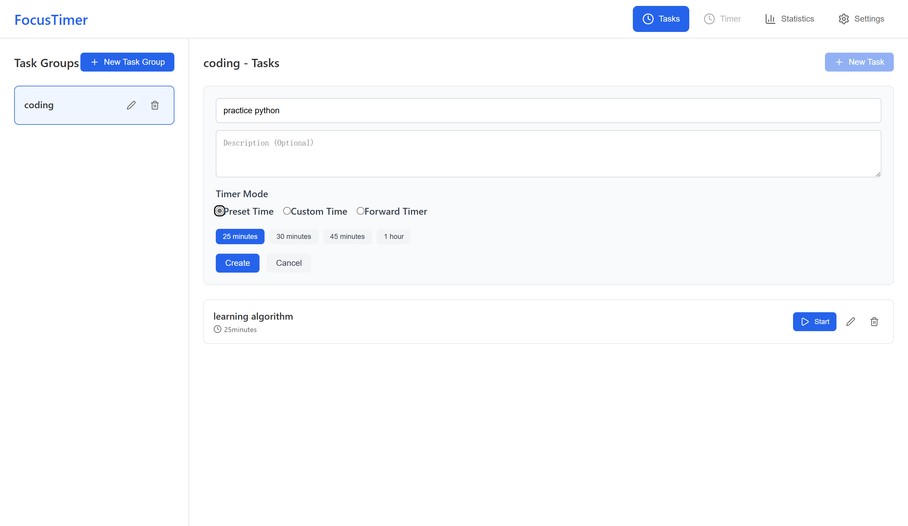
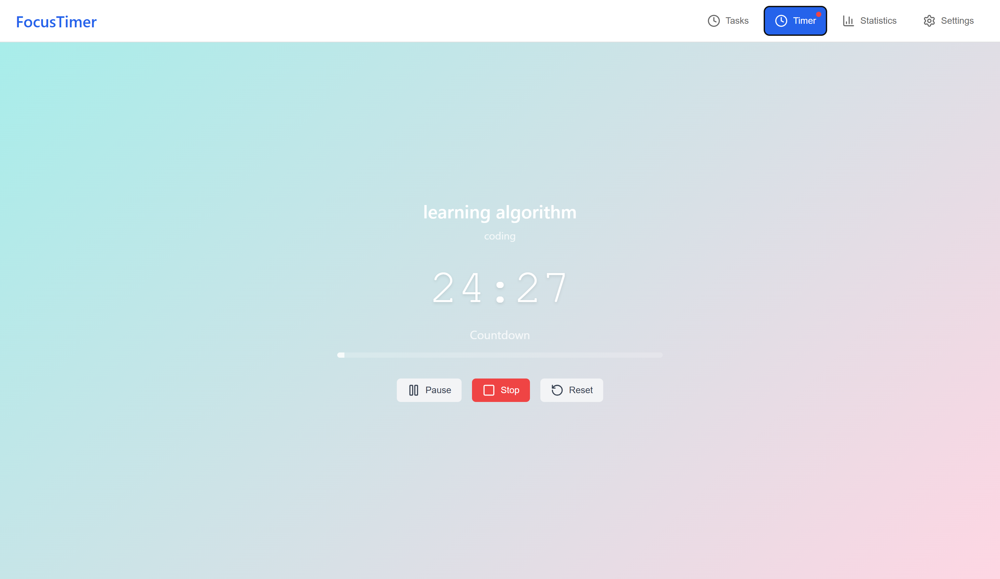
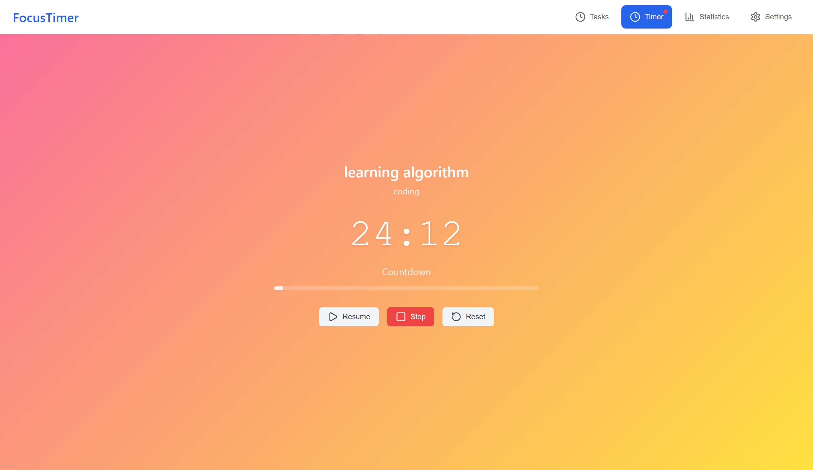
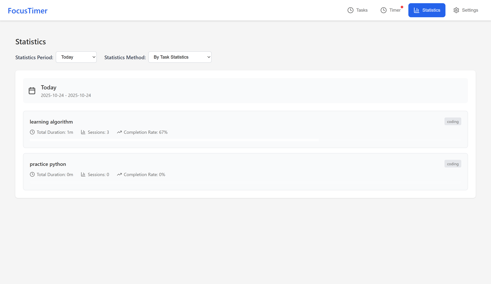
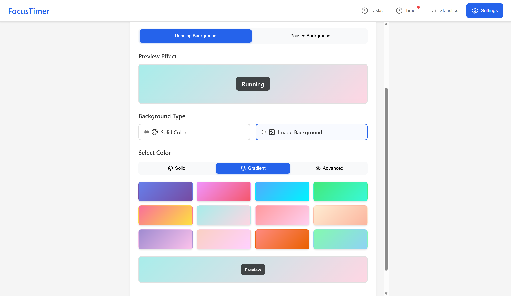
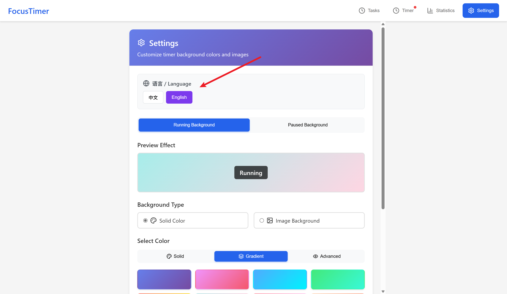

# FocusTimer 使用说明 / Usage Guide

## 快速开始 / Quick Start

### 中文
1. **启动应用**: 运行 `npm run tauri dev` 启动开发版本
2. **创建任务组**: 点击"新建任务组"按钮，输入名称（如"英语学习"）
3. **添加任务**: 选择任务组，点击"新建任务"，设置任务名称和计时方式
4. **开始计时**: 点击任务的"开始"按钮，自动切换到计时器界面
5. **查看统计**: 切换到"统计报告"标签查看学习/工作时间统计

### English
1. **Launch App**: Run `npm run tauri dev` to start the development version
2. **Create Task Group**: Click "New Task Group" button, enter name (e.g., "English Learning")
3. **Add Tasks**: Select task group, click "New Task", set task name and timer mode
4. **Start Timer**: Click "Start" button on task, automatically switch to timer interface
5. **View Statistics**: Switch to "Statistics" tab to view learning/work time statistics

## 功能详解 / Features Overview

### 任务组管理 / Task Group Management

#### 中文
- **创建**: 输入任务组名称和描述
- **编辑**: 点击编辑按钮修改名称和描述
- **删除**: 点击删除按钮（会删除组内所有任务）

#### English
- **Create**: Enter task group name and description
- **Edit**: Click edit button to modify name and description
- **Delete**: Click delete button (will delete all tasks in the group)

### 任务管理 / Task Management

#### 中文
- **计时方式**:
  - **预设时间**: 25分钟、30分钟、45分钟、1小时
  - **自定义时间**: 输入任意分钟数
  - **正向计时**: 无时间限制，记录实际用时
- **操作**: 开始、编辑、删除任务

#### English
- **Timer Modes**:
  - **Preset Time**: 25 minutes, 30 minutes, 45 minutes, 1 hour
  - **Custom Time**: Enter any number of minutes
  - **Forward Timer**: No time limit, records actual time used
- **Operations**: Start, edit, delete tasks

### 计时器功能 / Timer Features

#### 中文
- **倒计时模式**: 显示剩余时间，时间到自动完成
- **正向计时模式**: 显示已用时间，无限制计时
- **控制按钮**:
  - **暂停/继续**: 暂停或恢复计时
  - **停止**: 结束当前会话
  - **重置**: 重新开始计时
- **进度条**: 倒计时模式下显示完成进度

#### English
- **Countdown Mode**: Shows remaining time, automatically completes when time is up
- **Forward Timer Mode**: Shows elapsed time, unlimited timing
- **Control Buttons**:
  - **Pause/Resume**: Pause or resume timing
  - **Stop**: End current session
  - **Reset**: Restart timing
- **Progress Bar**: Shows completion progress in countdown mode

### 统计报告 / Statistics Report

#### 中文
- **统计周期**:
  - 今天
  - 本周
  - 近15天
  - 本月
  - 自定义时间范围
- **统计方式**:
  - 按任务统计: 显示每个任务的详细数据
  - 按任务组统计: 显示每个任务组的汇总数据
- **统计指标**:
  - 总时长
  - 会话数
  - 完成率
  - 任务数（任务组统计）

#### English
- **Statistics Period**:
  - Today
  - This Week
  - Last 15 Days
  - This Month
  - Custom Date Range
- **Statistics Method**:
  - By Task Statistics: Shows detailed data for each task
  - By Task Group Statistics: Shows summary data for each task group
- **Statistics Metrics**:
  - Total Duration
  - Sessions
  - Completion Rate
  - Task Count (Task Group Statistics)

### 设置功能 / Settings Features

#### 中文
- **背景自定义**: 自定义计时器运行和暂停时的背景
  - **纯色背景**: 选择任意颜色
  - **渐变背景**: 预设渐变色彩
  - **图片背景**: 上传自定义图片
- **语言设置**: 支持中文和英文切换
- **透明度调节**: 支持颜色透明度设置

#### English
- **Background Customization**: Customize timer background for running and paused states
  - **Solid Color Background**: Choose any color
  - **Gradient Background**: Preset gradient colors
  - **Image Background**: Upload custom images
- **Language Settings**: Support Chinese and English switching
- **Transparency Control**: Support color transparency settings

## 使用技巧 / Usage Tips

### 中文
1. **番茄工作法**: 使用25分钟倒计时进行专注工作
2. **学习记录**: 创建"学习"任务组，记录不同科目的学习时间
3. **项目跟踪**: 使用正向计时记录项目实际用时
4. **习惯养成**: 定期查看统计报告，了解时间分配情况
5. **多语言使用**: 在设置中切换语言，支持中英文界面

### English
1. **Pomodoro Technique**: Use 25-minute countdown for focused work
2. **Learning Records**: Create "Learning" task groups to record study time for different subjects
3. **Project Tracking**: Use forward timer to record actual project time
4. **Habit Building**: Regularly check statistics reports to understand time allocation
5. **Multilingual Usage**: Switch languages in settings, supports Chinese and English interfaces

## 项目演示 / Project Screenshots

### 主界面 / Main Interface

*主界面展示任务组和任务管理功能 / Main interface showing task group and task management features*

### 计时器界面 / Timer Interface

*计时器界面支持倒计时和正向计时 / Timer interface supporting countdown and forward timing*

### 计时器暂停界面 / Timer Paused Interface

*计时器暂停状态界面 / Timer paused state interface*

### 统计报告 / Statistics Report

*统计报告提供详细的时间分析 / Statistics report providing detailed time analysis*

### 设置界面 / Settings Interface

*设置界面支持背景自定义和语言切换 / Settings interface supporting background customization and language switching*

### 多语言支持 / Multilingual Support

*语言设置界面，支持中英文切换 / Language setting interface supporting Chinese and English switching*

## 数据存储 / Data Storage

### 中文
- 所有数据存储在本地 SQLite 数据库中
- 数据文件位置: `src-tauri/todolist.db`
- 支持数据持久化，重启应用后数据不丢失
- 背景设置和语言偏好保存在浏览器本地存储中

### English
- All data is stored in local SQLite database
- Data file location: `src-tauri/todolist.db`
- Supports data persistence, data is not lost after app restart
- Background settings and language preferences are saved in browser local storage

## 快捷键 / Keyboard Shortcuts

### 中文
- `Ctrl+R`: 刷新应用
- `F11`: 全屏模式
- `Ctrl+Shift+I`: 开发者工具（开发模式）

### English
- `Ctrl+R`: Refresh application
- `F11`: Fullscreen mode
- `Ctrl+Shift+I`: Developer tools (development mode)

## 故障排除 / Troubleshooting

### 中文
1. **应用无法启动**: 检查 Rust 和 Node.js 环境
2. **数据库错误**: 删除 `todolist.db` 文件重新创建
3. **界面异常**: 检查浏览器控制台错误信息
4. **编译失败**: 运行 `cargo clean` 清理 Rust 缓存
5. **语言切换不生效**: 刷新页面或重启应用
6. **背景设置不保存**: 检查浏览器本地存储权限

### English
1. **App won't start**: Check Rust and Node.js environment
2. **Database error**: Delete `todolist.db` file to recreate
3. **Interface issues**: Check browser console error messages
4. **Compilation failure**: Run `cargo clean` to clear Rust cache
5. **Language switching not working**: Refresh page or restart app
6. **Background settings not saving**: Check browser local storage permissions

## 技术特性 / Technical Features

### 中文
- **跨平台**: 支持 Windows、macOS、Linux
- **现代化**: 使用最新的 Tauri 2.0 和 React 19
- **类型安全**: TypeScript + Rust 双重类型检查
- **高性能**: 原生性能 + Web 技术
- **离线使用**: 无需网络连接
- **多语言**: 内置中英文支持
- **自定义**: 支持背景颜色、渐变、图片自定义

### English
- **Cross-platform**: Supports Windows, macOS, Linux
- **Modern**: Uses latest Tauri 2.0 and React 19
- **Type-safe**: TypeScript + Rust dual type checking
- **High Performance**: Native performance + Web technology
- **Offline Usage**: No internet connection required
- **Multilingual**: Built-in Chinese and English support
- **Customizable**: Supports background color, gradient, and image customization

## 开发指南 / Development Guide

### 中文
- **前端**: React + TypeScript + Vite
- **后端**: Rust + Tauri
- **数据库**: SQLite
- **UI组件**: Lucide React 图标
- **样式**: CSS3 + 响应式设计

### English
- **Frontend**: React + TypeScript + Vite
- **Backend**: Rust + Tauri
- **Database**: SQLite
- **UI Components**: Lucide React icons
- **Styling**: CSS3 + Responsive design